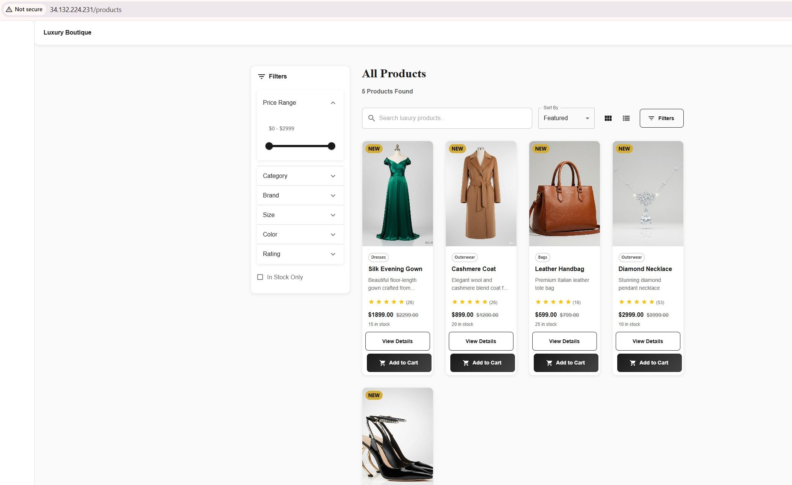
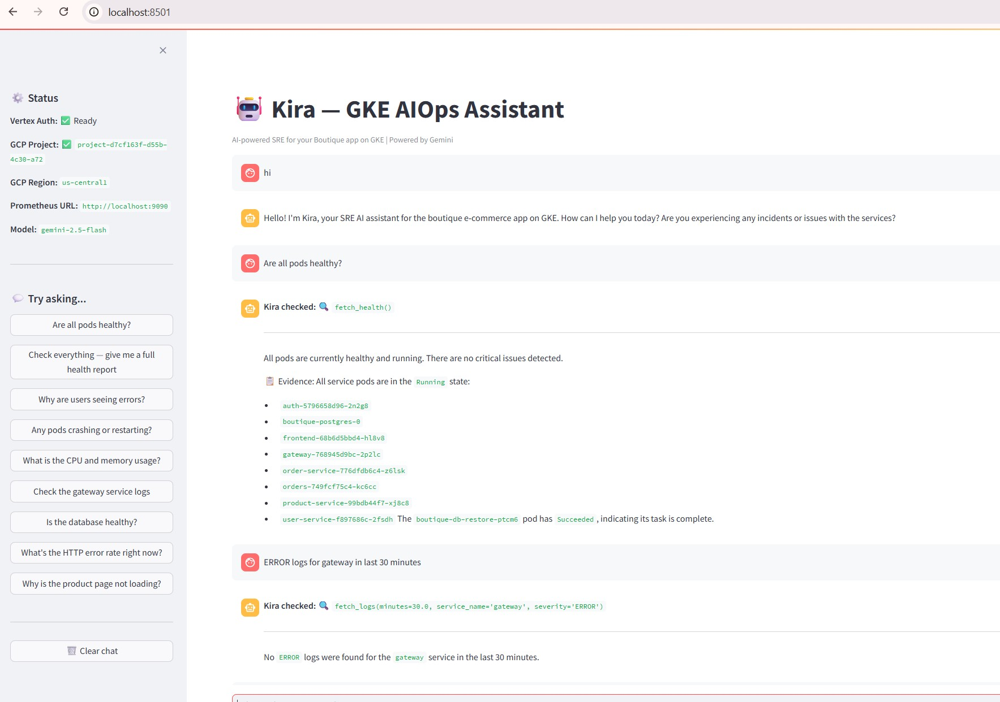
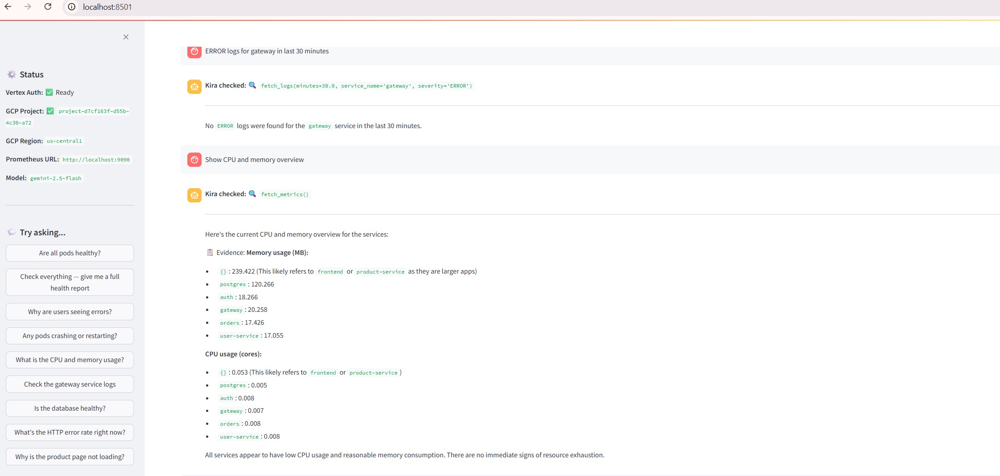

# Kira — AI-Powered SRE Assistant for GKE

Kira is an AI SRE assistant that diagnoses live issues in your GKE cluster. Built with Streamlit, Vertex AI Gemini, and 3 investigation tools.

---

## Architecture

```
User (Streamlit UI)
  │
  ▼
Gemini on Vertex AI  ← decides what to investigate
  ├── fetch_logs()    → GCP Cloud Logging (pod logs)
  ├── fetch_metrics() → Prometheus on GKE (CPU, memory, request rates)
  └── fetch_health()  → Kubernetes API (pod/node status)
  │
  ▼
Structured response: root cause + evidence + fix
```

Kira uses an **agentic loop** — Gemini autonomously decides which tools to call, gathers data, then returns a structured diagnosis with evidence.

---

## Prerequisites

1. **GCP project** with GKE cluster running the boutique app
2. **Vertex AI API** enabled in your project
3. **ADC authentication** configured (no API key needed)
4. **kubectl** configured to access your cluster
5. **Python 3.10+**

---

## Setup

```bash
cd projects/aiops-gcp-assistant

# Create virtual environment
python3 -m venv .venv
source .venv/bin/activate      # Linux/macOS/WSL
# .venv\Scripts\activate       # Windows PowerShell

# Install dependencies
pip install -r requirements.txt

# Authenticate with GCP (one-time)
gcloud auth application-default login

# Create .env from template
cp .env.example .env
```

Edit `.env` with your values:

```env
GCP_PROJECT_ID=your-project-id
GCP_REGION=us-central1
PROMETHEUS_URL=http://localhost:9090
GEMINI_MODEL=gemini-2.5-flash
```

---

## Running

### 1. Start Prometheus port-forward (for metrics tool)

```bash
kubectl port-forward svc/kube-prometheus-stack-prometheus -n monitoring 9090:9090
```

### 2. Start Kira

```bash
streamlit run app.py
```

Open http://localhost:8501

---

## Screenshots

### Boutique App Running


### Boutique App Running 2



### Kira Investigation Results





The first two screenshots show the Boutique App running, and the lower screenshots show Kira investigation results.

---

## Tools

| Tool | Data Source | What It Checks |
|------|------------|----------------|
| `fetch_logs` | GCP Cloud Logging | Pod logs — errors, crashes, exceptions |
| `fetch_metrics` | Prometheus HTTP API | CPU, memory, HTTP error rates, request rates |
| `fetch_health` | Kubernetes Python client | Pod status, restarts, OOMKilled, CrashLoopBackOff |

---

## Example Questions

- "Are all pods healthy?"
- "Why are users seeing errors?"
- "Check the gateway service logs"
- "What's the HTTP error rate right now?"
- "Give me a full health report"

---

## How It Works

1. You ask a question in the Streamlit UI
2. Gemini (via Vertex AI) reads your question and decides which tools to call
3. Kira executes the tools and sends results back to Gemini
4. Gemini correlates the data and responds with:
   - **Root Cause** — what went wrong
   - **Evidence** — specific data from logs/metrics/pods
   - **Fix** — exact steps to resolve it

---

## Files

| File | Purpose |
|------|---------|
| `app.py` | Streamlit UI + Gemini agentic loop |
| `tools.py` | 3 investigation tools (logs, metrics, health) |
| `requirements.txt` | Python dependencies |
| `.env.example` | Environment variable template |

---

## Troubleshooting

| Problem | Fix |
|---------|-----|
| "GCP_PROJECT_ID not set" | Add it to `.env` |
| "Vertex AI initialization failed" | Run `gcloud auth application-default login` and enable Vertex AI API |
| "Cannot connect to Prometheus" | Start port-forward: `kubectl port-forward svc/kube-prometheus-stack-prometheus -n monitoring 9090:9090` |
| "Cannot load Kubernetes config" | Run `gcloud container clusters get-credentials CLUSTER --zone ZONE` |
| Quota/rate limit errors | Try a different model in `.env`: `GEMINI_MODEL=gemini-1.5-flash-002` |
